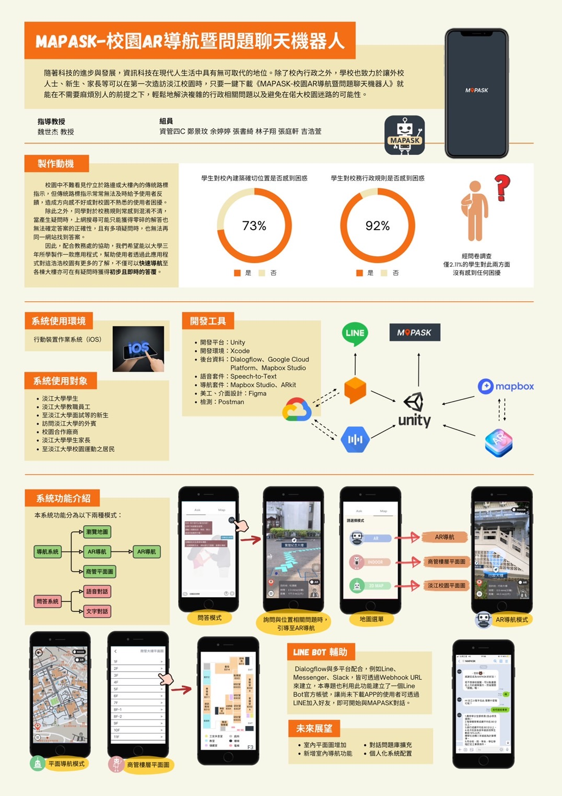

# -MapASK
* **前言**
  * 隨著科技的進步與發展，許多產品轉型成電子的形式來幫助人們解決生活上各個層面的問題。除了校內行政之外，學校也致力於讓外校人士、新生、家長等
可以在第一次造訪淡江校園時，只要一鍵下載《MAPASK-校園 AR 導航暨問題聊天機器人》就能輕鬆地解決複雜的行政相關問題以及避免在偌大校園中迷路。  
  * 擴增實境(Augment Reality, AR)技術漸漸開始流行，基於適地性行動遊戲(Location-Based Mobile Game(LBMG))並結合 AR 所製作。透過APP取得使用者位置
並找出至校園內各個大樓入口的路徑，讓使用者快速到達目的地。
在開發上使用 UNITY，並結合 Mapbox-unity-SDK，使得 APP 支援 Andriod 和 IOS
系統。  
  * 關鍵字: 聊天機器人、擴增實境、校園導覽
* **動機**
   * 校園中不難看見佇立於路邊或大樓內的傳統路標指示，但傳統路標指示常常無法及時給予使用者反饋，對於方向感不好者更是看得一頭霧水，因此當使用者第一次來到不熟悉的環境時，更容易被設置不夠密集的路標混淆。  
除此之外，當同學對於校務規則有疑問時，經常只能獲得零碎的解答且無法確認答案的正確性；當有不同性質的問題時，也無法在同一資源中找到答案。  
如今有不少政府單位、銀行、企業等開發專屬的聊天機器人，以快速向民眾解惑，也省下了不少人力成本。   
因此，根據教務處提供的資料，我們決定製作一款應用程式，幫助不論是新生、家長、教職員工都能透過這個應用程式對這浩浩校園有更多的了解。

* **功能**
     * 導航：
         1. AR模式：在AR實境中呈現導航路徑和地標，使用者可沿著畫面中的引導                   
                             路徑前進即可。
         2. 平面模式：客製化地圖。可直接點選大樓圖標即可開始導航。
     * 問答機器人：提供校內事務的統一詢問窗口。以引導式問答的方式，提高服務品質，可
         直接結合導航以輔助回答，並支援語音的問答方式。
* **系統開發工具**
     * 開發平台：UNITY
     * 開發環境：Xcode、VScode
     * 後台資料：Dialogflow、Google Cloud Platform、Mapbox Studio
     * 語音套件：Speech-to-Text
     * 導航套件：Mapbox、ARkit
     * 美工：Figma
     * 檢測：Postman
     * 開發使用語言：C#  

